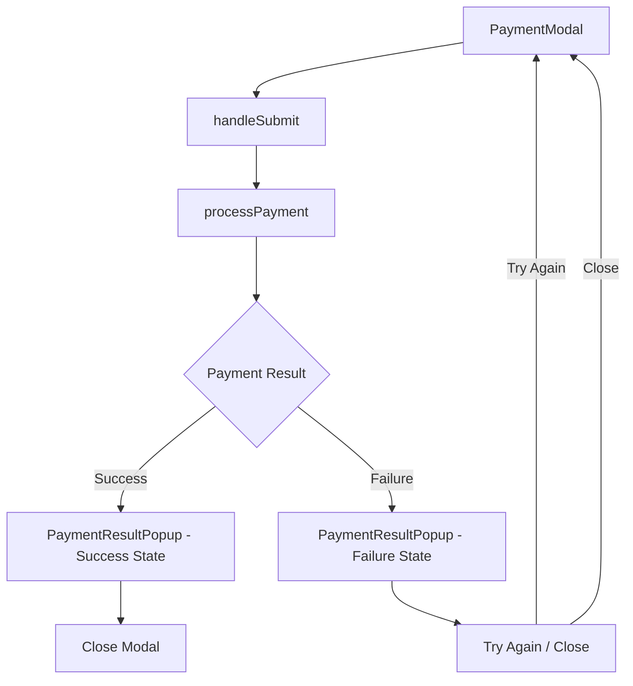

# Design Document: Payment Result Popup

## Overview

This feature replaces the current toast notification system for payment results with a comprehensive modal popup dialog. The PaymentResultPopup component will display detailed transaction information for both successful and failed payments, providing users with clear visual feedback and actionable next steps.

## Architecture

The solution follows a component-based architecture integrated into the existing payment flow:



### Component Hierarchy

```
PaymentModal
├── PaymentForm (existing)
└── PaymentResultPopup (new)
    ├── SuccessContent
    │   ├── SuccessIcon
    │   ├── TransactionDetails
    │   └── CloseButton
    └── FailureContent
        ├── ErrorIcon
        ├── ErrorDetails
        ├── TryAgainButton
        └── CloseButton
```

## Components and Interfaces

### PaymentResultPopup Component

```typescript
interface PaymentResultData {
  success: boolean;
  transactionId?: string;
  authCode?: string;
  amount: number;
  orderNumber?: string;
  errorMessage?: string;
  errorCode?: string;
  paymentMethod: 'card' | 'ach' | 'manual';
  cardType?: string;
  cardLastFour?: string;
  accountType?: string;
  accountLastFour?: string;
}

interface PaymentResultPopupProps {
  isOpen: boolean;
  onClose: () => void;
  onTryAgain?: () => void;
  result: PaymentResultData;
}
```

### Integration with PaymentModal

The PaymentModal component will be updated to:
1. Track payment result state instead of just success boolean
2. Show PaymentResultPopup instead of toast notifications
3. Handle "Try Again" action by resetting to payment form
4. Handle "Close" action by closing the entire payment modal

```typescript
// State additions to PaymentModal
const [paymentResult, setPaymentResult] = useState<PaymentResultData | null>(null);
const [showResultPopup, setShowResultPopup] = useState(false);
```

## Data Models

### PaymentResultData

| Field | Type | Description |
|-------|------|-------------|
| success | boolean | Whether the payment succeeded |
| transactionId | string? | Gateway transaction identifier |
| authCode | string? | Authorization code from gateway |
| amount | number | Payment amount in dollars |
| orderNumber | string? | Associated order number |
| errorMessage | string? | Human-readable error description |
| errorCode | string? | Gateway error code |
| paymentMethod | 'card' \| 'ach' \| 'manual' | Type of payment used |
| cardType | string? | Card brand (Visa, Mastercard, etc.) |
| cardLastFour | string? | Last 4 digits of card |
| accountType | string? | ACH account type |
| accountLastFour | string? | Last 4 digits of account |

## Correctness Properties

*A property is a characteristic or behavior that should hold true across all valid executions of a system-essentially, a formal statement about what the system should do. Properties serve as the bridge between human-readable specifications and machine-verifiable correctness guarantees.*

### Property 1: Success state displays correct heading
*For any* PaymentResultData with success=true, the rendered PaymentResultPopup SHALL contain the text "Payment Successful"
**Validates: Requirements 1.1**

### Property 2: Transaction ID display
*For any* PaymentResultData with a transactionId value, the rendered PaymentResultPopup SHALL contain that exact transactionId string
**Validates: Requirements 1.2**

### Property 3: Amount currency formatting
*For any* PaymentResultData with an amount value, the rendered PaymentResultPopup SHALL display the amount formatted as "$X.XX" currency format
**Validates: Requirements 1.3**

### Property 4: Authorization code conditional display
*For any* PaymentResultData with an authCode value, the rendered PaymentResultPopup SHALL contain that authCode; when authCode is undefined, it SHALL NOT display an authorization code section
**Validates: Requirements 1.4**

### Property 5: Failure state displays correct heading
*For any* PaymentResultData with success=false, the rendered PaymentResultPopup SHALL contain the text "Payment Failed"
**Validates: Requirements 2.1**

### Property 6: Error message display
*For any* PaymentResultData with success=false and an errorMessage value, the rendered PaymentResultPopup SHALL contain that exact errorMessage string
**Validates: Requirements 2.2**

### Property 7: Correct button based on result state
*For any* PaymentResultData with success=true, the rendered PaymentResultPopup SHALL display a "Done" or "Close" button; for success=false, it SHALL display a "Try Again" button
**Validates: Requirements 3.4**

### Property 8: Card payment method display
*For any* PaymentResultData with paymentMethod='card', cardType, and cardLastFour values, the rendered PaymentResultPopup SHALL contain both the cardType and cardLastFour strings
**Validates: Requirements 4.1**

### Property 9: ACH payment method display
*For any* PaymentResultData with paymentMethod='ach', accountType, and accountLastFour values, the rendered PaymentResultPopup SHALL contain both the accountType and accountLastFour strings
**Validates: Requirements 4.2**

### Property 10: Manual payment method display
*For any* PaymentResultData with paymentMethod='manual', the rendered PaymentResultPopup SHALL contain the text "Manual Payment"
**Validates: Requirements 4.3**

## Error Handling

### Payment Gateway Errors
- Display user-friendly error messages mapped from gateway error codes
- Show raw error code for reference/support purposes
- Provide "Try Again" option to retry payment

### Network Errors
- Display generic "Connection error" message
- Suggest user check internet connection
- Provide "Try Again" option

### Validation Errors
- These are handled before payment submission
- Result popup only shows gateway/processing errors

## Testing Strategy

### Property-Based Testing

The implementation will use Vitest with fast-check for property-based testing. Each correctness property will be implemented as a property-based test.

```typescript
// Example property test structure
import { fc } from '@fast-check/vitest';
import { test } from 'vitest';

// Property 1: Success state displays correct heading
test.prop([paymentResultArbitrary])('success state shows correct heading', (result) => {
  if (result.success) {
    const rendered = render(<PaymentResultPopup result={result} ... />);
    expect(rendered.getByText('Payment Successful')).toBeInTheDocument();
  }
});
```

### Test Configuration
- Minimum 100 iterations per property test
- Use fast-check arbitraries for generating PaymentResultData
- Each property test tagged with format: `**Feature: payment-result-popup, Property {number}: {property_text}**`

### Unit Tests
- Test component renders without crashing
- Test close button triggers onClose callback
- Test "Try Again" button triggers onTryAgain callback
- Test conditional rendering of optional fields

