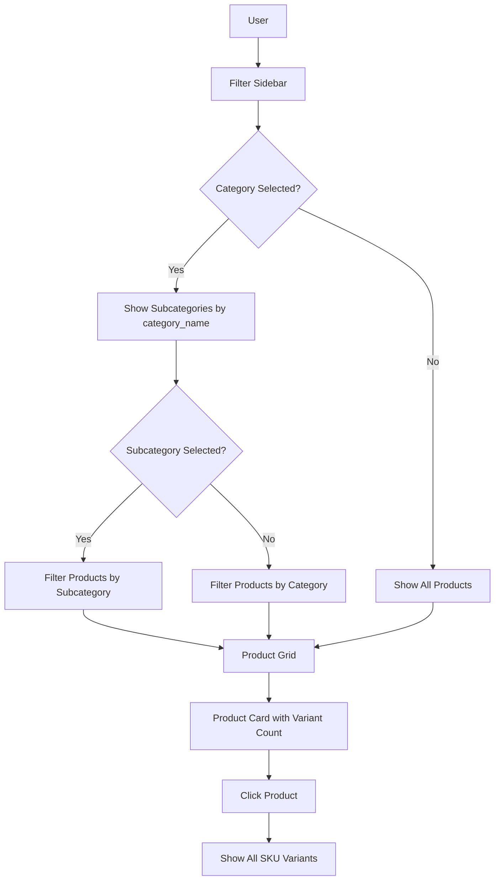

# Design Document: Erply-Style Product Hierarchy

## Overview

This design implements an Erply-style product hierarchy system by **fixing existing components** without creating new files or database migrations. The system uses the existing `category_configs`, `subcategory_configs`, and `products` tables. The key fix is ensuring proper data flow between components and correct filtering logic.

## Architecture

### Current State (with bugs)
```
Category → Product → Sizes (variants)
- subcategory_configs uses category_name (string) to link to categories ✓
- PharmacyFilterSidebar expects products prop but ProductShowcase doesn't pass it ✗
- Subcategory filtering uses category_id but table has category_name ✗
```

### Target State (fixed)
```
Category → Subcategory → Product → Sizes (variants)
- Use existing category_name relationship in subcategory_configs ✓
- Pass products prop to PharmacyFilterSidebar ✓
- Fix subcategory filtering to use category_name ✓
```

### Data Flow


## Components to Update (NO NEW FILES)

### 1. Existing Database Structure (NO CHANGES NEEDED)

#### category_configs Table (Existing)
```
- id: number
- category_name: string
- size_units: string[]
- default_unit: string
- has_rolls: boolean
- requires_case: boolean
```

#### subcategory_configs Table (Existing)
```
- id: number
- category_name: string  ← Links to category by NAME (not ID)
- subcategory_name: string
```

#### products Table (Existing)
```
- category: string      ← Category name
- subcategory: string   ← Subcategory name (may be empty)
```

### 2. Files to Update

#### Fix 1: PharmacyFilterSidebar.tsx
**Problem**: Uses `category_id` to filter subcategories, but table uses `category_name`
**Solution**: Change filter logic to use `category_name`

```typescript
// BEFORE (broken):
setFilteredSubcategories(subcategories.filter((sub) => sub.category_id === selectedCat.id))

// AFTER (fixed):
setFilteredSubcategories(subcategories.filter((sub) => 
  sub.category_name.toLowerCase() === selectedCategory.toLowerCase()
))
```

#### Fix 2: ProductShowcase.tsx
**Problem**: Missing `products` prop when calling PharmacyFilterSidebar
**Solution**: Pass `products={filteredProducts}` to PharmacyFilterSidebar

```typescript
// BEFORE (broken):
<PharmacyFilterSidebar
  searchQuery={searchQuery}
  setSearchQuery={setSearchQuery}
  selectedCategory={selectedCategory}
  setSelectedCategory={setSelectedCategory}
  selectedSubcategory={selectedSubcategory}
  setSelectedSubcategory={setSelectedSubcategory}
  priceRange={priceRange}
  setPriceRange={setPriceRange}
/>

// AFTER (fixed):
<PharmacyFilterSidebar
  searchQuery={searchQuery}
  setSearchQuery={setSearchQuery}
  selectedCategory={selectedCategory}
  setSelectedCategory={setSelectedCategory}
  selectedSubcategory={selectedSubcategory}
  setSelectedSubcategory={setSelectedSubcategory}
  priceRange={priceRange}
  setPriceRange={setPriceRange}
  products={filteredProducts}  // ← ADD THIS
/>
```

#### Fix 3: PharmacyFilterSidebar.tsx - Make products prop optional with default
**Problem**: Component crashes if products prop is undefined
**Solution**: Add default empty array

```typescript
// Interface update:
interface PharmacyFilterSidebarProps {
  // ... existing props
  products?: any[]  // Make optional
}

// Destructure with default:
export const PharmacyFilterSidebar = ({
  // ... other props
  products = [],  // Default to empty array
}: PharmacyFilterSidebarProps) => {
```

### 3. Filter Logic (Update in PharmacyFilterSidebar.tsx)

```typescript
// Subcategory filtering - use category_name not category_id
useEffect(() => {
  if (selectedCategory === "all") {
    setFilteredSubcategories(subcategories)
  } else {
    // FIX: Use category_name instead of category_id
    setFilteredSubcategories(
      subcategories.filter((sub) => 
        sub.category_name.toLowerCase() === selectedCategory.toLowerCase()
      )
    )
  }
  // Reset subcategory when category changes
  setSelectedSubcategory("all")
}, [selectedCategory, subcategories])
```

## Correctness Properties

*A property is a characteristic or behavior that should hold true across all valid executions of a system-essentially, a formal statement about what the system should do. Properties serve as the bridge between human-readable specifications and machine-verifiable correctness guarantees.*

### Property 1: Subcategory Filter Correctness
*For any* list of products and any selected subcategory, filtering by that subcategory SHALL return only products where `product.subcategory` matches the selected subcategory (case-insensitive).
**Validates: Requirements 1.4**

### Property 2: Category Filter Returns All Subcategory Products
*For any* list of products and any selected category (without subcategory filter), filtering by that category SHALL return all products where `product.category` matches, regardless of their subcategory.
**Validates: Requirements 1.5**

### Property 3: Category-Subcategory Relationship by Name
*For any* subcategory in the system, the subcategory's `category_name` field SHALL match an existing category name in `category_configs`.
**Validates: Requirements 2.2, 5.1**

### Property 4: Product Count Accuracy
*For any* category or subcategory, the displayed product count SHALL equal the actual number of products that would be returned by filtering for that category/subcategory.
**Validates: Requirements 2.4**

### Property 5: Variant Count Accuracy
*For any* product displayed in the grid, the variant count shown SHALL equal the actual number of sizes/variants in `product.sizes` array.
**Validates: Requirements 3.2**

### Property 6: Search Respects Category Filter
*For any* search query with an active category filter, all search results SHALL belong to the selected category.
**Validates: Requirements 7.1**

### Property 7: Search Respects Subcategory Filter
*For any* search query with an active subcategory filter, all search results SHALL belong to the selected subcategory.
**Validates: Requirements 7.2**

## Error Handling

### Filter Errors
- If category/subcategory data fails to load, show error toast and allow manual retry
- If products prop is undefined, use empty array as default
- If product count calculation fails, show "0" instead of crashing

### Data Integrity Errors
- If a product has empty category/subcategory, still display it but exclude from filtered results
- If subcategory references non-existent category, still show subcategory but log warning

## Testing Strategy

### Manual Testing
1. Select a category → verify subcategories filter correctly
2. Select a subcategory → verify only matching products show
3. Clear filters → verify all products show
4. Search with category filter → verify results respect filter

### Unit Testing (Optional)
- Test filter functions with various category/subcategory combinations
- Test product count calculations

## Summary of Changes

| File | Change | Reason |
|------|--------|--------|
| `PharmacyFilterSidebar.tsx` | Fix subcategory filter to use `category_name` | Table uses `category_name`, not `category_id` |
| `PharmacyFilterSidebar.tsx` | Make `products` prop optional with default `[]` | Prevent crash when prop not passed |
| `ProductShowcase.tsx` | Add `products={filteredProducts}` prop | Fix missing prop causing count issues |
| `ProductShowcase.tsx` (mobile) | Add same `products` prop to mobile filter | Consistency |

**Total: 2 files, ~10 lines of code changes**
