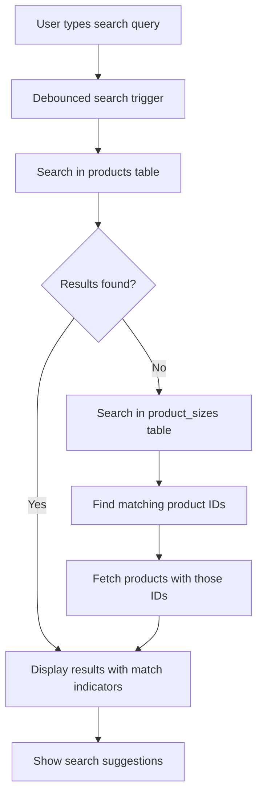

# Advanced Search Implementation Guide

## 🎯 FEATURE OVERVIEW

Advanced search functionality that allows users to search across multiple product fields including:
- **Product Information**: Name, description, category, subcategory
- **Product Codes**: SKU, NDC codes, UPC codes, lot numbers
- **Size Information**: Size values, size units, size SKUs
- **Size Codes**: NDC/UPC codes at size level

## ✅ IMPLEMENTED FEATURES

### 1. **Multi-Field Search** (`src/services/productService.ts`)
```typescript
// Searches across multiple product fields
query = query.or(`
  name.ilike.%${searchTerm}%,
  description.ilike.%${searchTerm}%,
  category.ilike.%${searchTerm}%,
  subcategory.ilike.%${searchTerm}%,
  sku.ilike.%${searchTerm}%,
  ndcCode.ilike.%${searchTerm}%,
  upcCode.ilike.%${searchTerm}%,
  lotNumber.ilike.%${searchTerm}%
`);
```

### 2. **Size-Based Search Fallback**
- If no products found in main search, automatically searches in product sizes
- Searches size values, units, SKUs, and codes
- Returns products that have matching sizes

### 3. **Search Match Highlighting** (`src/utils/searchHighlight.ts`)
- Identifies which fields matched the search query
- Categorizes matches as 'exact' or 'partial'
- Provides detailed match information for UI display

### 4. **Visual Search Indicators** (`src/components/search/SearchMatchIndicator.tsx`)
- Shows users why a product matched their search
- Color-coded badges for different match types
- Icons for different field types (SKU, Size, Category)

### 5. **Search Suggestions** (`src/components/search/SearchSuggestions.tsx`)
- Intelligent suggestions based on partial input
- Size-based suggestions (e.g., "10" → "10ml", "10mg", "10oz")
- Common pharmacy terms and units
- Category and container suggestions

### 6. **Enhanced UI Placeholders**
- Updated search inputs with descriptive placeholders
- Tooltip hints explaining search capabilities
- Better user guidance on what can be searched

---

## 🔍 SEARCH EXAMPLES

### Example 1: Size Search
**User types**: `"10ml"`
**Results**: All products with sizes containing "10ml"
**Match indicator**: Shows "Size 1 Value" badge

### Example 2: SKU Search  
**User types**: `"ABC123"`
**Results**: Products with SKU "ABC123" OR sizes with SKU "ABC123"
**Match indicator**: Shows "Product SKU" or "Size 1 SKU" badge

### Example 3: NDC Code Search
**User types**: `"12345-678"`
**Results**: Products or sizes with matching NDC codes
**Match indicator**: Shows "NDC Code" badge

### Example 4: Category Search
**User types**: `"vial"`
**Results**: Products in "vial" category OR with "vial" in name/description
**Match indicator**: Shows "Category" badge

---

## 🎨 UI ENHANCEMENTS

### 1. **Search Input Improvements**
```typescript
// Before
placeholder="Search products..."

// After  
placeholder="Search products, sizes, SKU, NDC codes..."
title="Search in: Product name, description, category, SKU, size values, NDC/UPC codes"
```

### 2. **Search Match Indicators**
- **Exact matches**: Green badges with checkmark
- **Partial matches**: Blue badges
- **Field-specific icons**: Hash for codes, Package for sizes, Tag for categories

### 3. **Search Suggestions**
- **Smart suggestions**: Based on input patterns
- **Color-coded**: Different colors for different suggestion types
- **Interactive**: Click to apply suggestion

---

## 📁 FILES MODIFIED

### Core Search Logic
- `src/services/productService.ts` - Enhanced fetchProductsService with multi-field search
- `src/utils/searchHighlight.ts` - Search matching and highlighting utilities

### UI Components
- `src/components/search/SearchMatchIndicator.tsx` - Visual match indicators
- `src/components/search/SearchSuggestions.tsx` - Search suggestions component

### Product Display Components
- `src/pages/Products.tsx` - Public products page with search indicators
- `src/pages/admin/Products.tsx` - Admin products page with search indicators
- `src/components/pharmacy/components/product-showcase/PharmacyProductCard.tsx` - Product cards with match indicators
- `src/components/pharmacy/components/product-showcase/PharmacyProductGrid.tsx` - Grid component with search query support

### Search Inputs Enhanced
- `src/pages/Products.tsx` - Main products search
- `src/pages/admin/Products.tsx` - Admin products search  
- `src/components/pharmacy/components/product-showcase/SearchFilters.tsx` - Pharmacy search filters

---

## 🚀 PERFORMANCE OPTIMIZATIONS

### 1. **Debounced Search** (Already implemented in `use-products.ts`)
- 300ms delay prevents excessive API calls
- Request cancellation prevents race conditions

### 2. **Fallback Search Strategy**
- Primary search in products table
- Fallback to sizes table only if no results found
- Prevents unnecessary complex joins

### 3. **Efficient Queries**
- Uses Supabase's `or()` operator for multiple field search
- Separate queries for product and size searches
- Minimal data fetching with specific selects

---

## 🎯 SEARCH FLOW



---

## 🔧 USAGE EXAMPLES

### Basic Implementation
```typescript
// In any component
import { getSearchMatches } from '@/utils/searchHighlight';
import { SearchMatchIndicator } from '@/components/search/SearchMatchIndicator';

const matches = getSearchMatches(product, searchQuery);

<SearchMatchIndicator 
  matches={matches} 
  searchQuery={searchQuery}
  className="mb-2"
/>
```

### With Search Suggestions
```typescript
import { SearchSuggestions } from '@/components/search/SearchSuggestions';

<SearchSuggestions
  searchQuery={searchQuery}
  onSuggestionClick={(suggestion) => setSearchQuery(suggestion)}
  className="absolute top-full left-0 right-0 z-10 mt-1"
/>
```

---

## 📊 EXPECTED IMPROVEMENTS

### User Experience
- **Faster product discovery**: Users can find products by any attribute
- **Better search feedback**: Visual indicators show why products matched
- **Intelligent suggestions**: Helps users refine their search

### Search Effectiveness
- **Higher success rate**: Multiple search fields increase match probability
- **Reduced search time**: Smart suggestions guide users to relevant terms
- **Better product visibility**: Products discoverable through size attributes

### Business Impact
- **Increased conversions**: Easier product discovery leads to more orders
- **Reduced support queries**: Users can find products independently
- **Better inventory utilization**: Hidden products become discoverable

---

## 🔮 FUTURE ENHANCEMENTS

### 1. **Search Analytics**
- Track popular search terms
- Identify search patterns
- Optimize product tagging based on searches

### 2. **Fuzzy Search**
- Handle typos and misspellings
- Phonetic matching for product names
- Abbreviation expansion

### 3. **Search Filters Integration**
- Combine text search with category filters
- Price range search
- Availability filters

### 4. **Advanced Suggestions**
- Machine learning-based suggestions
- Popular searches by user type
- Contextual suggestions based on browsing history

---

## 🎉 SUMMARY

The advanced search implementation provides:

✅ **Multi-field search** across products and sizes
✅ **Visual match indicators** showing why products matched
✅ **Smart search suggestions** for better user guidance
✅ **Enhanced UI** with better placeholders and hints
✅ **Performance optimized** with debouncing and efficient queries
✅ **Fallback search strategy** for comprehensive results

Users can now search by:
- Product names and descriptions
- SKU codes and product codes
- Size values and units
- NDC/UPC codes at product and size level
- Categories and subcategories

This makes product discovery much more powerful and user-friendly! 🎯